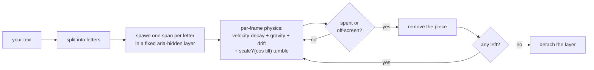

# @overpunch/confettitext

A confetti cannon where every particle is a **real letter of your text** — not a paper rectangle on a canvas, but a DOM letter-span that arcs out, tumbles through 3D, and falls. The physics are ported from [`canvas-confetti`](https://github.com/catdad/canvas-confetti) so the burst feels familiar; the letters carry variable-font weight jitter, so it reads as type.

[](https://www.npmjs.com/package/@overpunch/confettitext)
[](https://bundlephobia.com/package/@overpunch/confettitext)
[](./LICENSE)

**[▶ Try the live demo — confettitext.com](https://confettitext.com)**

- **Real letters, real DOM** — each piece is a `<span>` in your actual (variable) font, cycled from your text.
- **Familiar physics** — `particleCount`, `spread`, `angle`, `startVelocity`, `gravity`, `drift`, `decay`, `ticks`, `scalar`, `origin` behave just like canvas-confetti.
- **Typographic flourish** — per-particle `wght` jitter via `weightRange`, and a festive `colors` palette (or monochrome `currentColor`).
- **Mix in emoji & shapes** — add `symbols: ['🎉', '✨']` or classic `shapes: ['circle', 'strip']` to sprinkle them through the letters (or `text: ''` for an all-emoji / all-shape burst); emoji and combining sequences stay whole.
- **Zero dependencies**, framework-agnostic (vanilla core + optional React bindings), TypeScript-first.
- **Accessible** — the confetti layer is `aria-hidden`; bursts are skipped under `prefers-reduced-motion` by default; and the click trigger is **keyboard-operable** (focus + Enter/Space) when applied to a non-interactive element.

## Install

```bash
npm install @overpunch/confettitext
```

## Quickstart

> **React bindings live at the `/react` subpath** so a vanilla import never pulls React into your bundle. Import them from `@overpunch/confettitext/react`.

### React — drop-in component (click to burst its own text)

```tsx
import { ConfettiText } from '@overpunch/confettitext/react'

<ConfettiText as="h1" particleCount={120} spread={80}>
  Congrats!
</ConfettiText>
```

### React — hook with imperative `fire()`

```tsx
import { useConfettiText } from '@overpunch/confettitext/react'

const { ref, fire } = useConfettiText({ particleCount: 90 })

<h1 ref={ref}>You did it</h1>
<button onClick={() => fire()}>Celebrate</button>
```

The component/hook set `origin` from the element's on-screen position automatically, use the element's own text unless you pass `text`, and render the pieces in that element's font. For the default `'click'` trigger, a non-interactive element (e.g. the `<h1>` above) is made keyboard-operable — it gets `tabindex="0"`, `role="button"`, and fires on Enter/Space (native controls like `<button>` are left alone). Switch timing with `trigger`: `'click'` (default), `'mount'`, `'inView'`, or `'manual'`.

### Vanilla JS

```ts
import { confettiText, attachConfettiText, clearConfettiText } from '@overpunch/confettitext'

// One-off burst from the viewport centre. Returns a ConfettiBurst — a Promise resolving to
// 'completed' | 'cleared', with a .clear() to cancel just this burst:
const burst = confettiText({ text: 'Hooray', particleCount: 120, spread: 90 })
const how = await burst  // 'completed' (ran its course) or 'cleared' (cancelled)
// burst.clear()         // …cancel only this burst, leaving others running

// Make an element burst its own text on click; returns a detach fn:
const detach = attachConfettiText(document.querySelector('h1')!)

// Cancel EVERY in-flight burst and remove the layer:
clearConfettiText()
```

### Webflow / no-code (one script tag)

```html
<script src="https://cdn.jsdelivr.net/npm/@overpunch/confettitext/dist/confettitext.webflow.min.js"></script>
<script>
  ConfettiText.attach(document.querySelector('h1'))          // click-to-burst
  // ConfettiText.fire({ text: 'Yay', particleCount: 120 })  // or fire directly
</script>
```

## Options

Every option is optional. Physics defaults mirror canvas-confetti.

| Option | Default | Description |
|---|---|---|
| `text` | see note | The word/phrase whose letters become confetti. Whitespace stripped; letters cycle through the pieces (emoji/combining sequences stay whole). Defaults to the bound element's text for `attachConfettiText`/the React bindings; a bare `confettiText()` with neither `text` nor `symbols` uses `'Yay'`. Text that strips to empty (and no `symbols`) falls back to a single `✦`. |
| `symbols` | — | Extra glyphs (emoji, symbols, short strings) mixed into the pool alongside the letters — passing only `symbols` (no `text`) gives an all-emoji burst, e.g. `symbols: ['🎉', '✨', '⭐']`. Emoji keep their native colour (the `colors` palette and `weightRange` only affect text glyphs). |
| `shapes` | — | Geometric particles (classic paper confetti) mixed in: `'square'`, `'circle'`, `'strip'`. Coloured from `colors` (or `currentColor`). Pair with `text: ''` for a shapes-only burst. |
| `particleCount` | `70` | How many letter-particles to emit. |
| `angle` | `90` | Launch direction in degrees — 90 = straight up, 0 = right. |
| `spread` | `62` | Angular spread of the burst in degrees. |
| `startVelocity` | `34` | Initial launch speed (px/frame). |
| `decay` | `0.9` | Per-frame velocity retention (air resistance). |
| `gravity` | `1.1` | Downward pull per frame. |
| `drift` | `0` | Constant horizontal bias; negative drifts left. |
| `ticks` | `200` | Particle lifetime in frames before it fades out. |
| `scalar` | `1` | Letter-size multiplier on the base ~18px particle size. |
| `origin` | `{ x: 0.5, y: 0.5 }` | Burst origin as viewport fractions; `x` and `y` are each optional and default to `0.5` (so `origin: { y: 0.7 }` works). React bindings set this automatically. |
| `colors` | festive palette | Palette letters are randomly coloured from (accepts a `readonly` array). Pass `null` **or `[]`** to leave letters `currentColor` (monochrome). |
| `weightRange` | `[400, 700]` | `[min, max]` variable-font `wght` jitter per particle. Requires a variable font on the page; also sets `font-weight` as a fallback for static fonts. Pass `null` to disable. |
| `fontFamily` | inherits | Font family for the particles. Element-fired bursts default to the source element's computed font. |
| `flat` | `false` | Disable the 3D paper-flip tumble (letters still rotate). |
| `zIndex` | `9999` | z-index of the fixed confetti layer. |
| `disableForReducedMotion` | `true` | Skip the burst when the user prefers reduced motion. |
| `trigger` | `'click'` | **React-only** (on `ReactConfettiTextOptions`): `'click'` \| `'mount'` \| `'inView'` \| `'manual'`. The vanilla core ignores it. |

## API

**Core** — `@overpunch/confettitext`:

- `confettiText(options?)` → `ConfettiBurst` — fire a one-shot burst (viewport-fraction `origin`). The returned burst is a `Promise<'completed' | 'cleared'>` (resolves `'completed'` when it runs its course, `'cleared'` if cancelled) with a `.clear()` to cancel just this burst. Hold the returned value to use `.clear()` — it's only on the burst object, not on a `.then()`-chained promise — and a resolved burst's `.clear()` is a no-op. Each burst gets its own fixed layer, so `zIndex` is independent per burst.
- `attachConfettiText(element, options?)` → `() => void` — click-to-burst (and Enter/Space) from an element's text/position; returns a detach fn.
- `clearConfettiText()` — remove **every** live particle across all bursts, cancel the loop, detach the layer, and resolve every pending burst.
- `CONFETTI_TEXT_CLASSES` — `{ layer: 'ct-layer', piece: 'ct-piece' }` for targeting the generated markup.
- `DEFAULT_COLORS` — the festive palette used when `colors` is unspecified.

**React** — `@overpunch/confettitext/react`:

- `useConfettiText(options?)` → `{ ref, fire }` — `ref` attaches to the source element; `fire(overrides?)` returns the `ConfettiBurst`.
- `<ConfettiText as="span" …>children</ConfettiText>` — renders `children` as the source text and, beyond the burst options, accepts `as` (default `'span'`), `className`, `style`, `aria-label`, and `role`.

### Exported types

From the core entry: `ConfettiTextOptions` (the burst options), `ConfettiOrigin` (`{ x?, y? }`), `ConfettiShape` (`'square' | 'circle' | 'strip'`), `ConfettiResult` (`'completed' | 'cleared'`), and `ConfettiBurst` (`Promise<ConfettiResult> & { clear() }`). From `/react`: `ReactConfettiTextOptions` (`extends ConfettiTextOptions` with `trigger`), `ConfettiTrigger` (`'click' | 'mount' | 'inView' | 'manual'`), and `ConfettiTextHandle` (the `{ ref, fire }` returned by `useConfettiText`). `/react` also re-exports the core surface for convenience.

## How it works

Every character of your text is wrapped in an absolutely-positioned `<span>` inside a single fixed, `pointer-events: none`, `aria-hidden` layer appended to `<body>`. Each frame, one `requestAnimationFrame` loop advances every live piece: `velocity` decays, `gravity`/`drift` accumulate, and a `scaleY(cos(tilt))` term produces the paper flip-through-3D tumble. Spent or off-screen pieces are removed; when none remain, the loop stops and the layer is detached. It's all real DOM, so the letters render in your (variable) font — element-fired bursts inherit the source element's computed font.



## Accessibility

- The confetti layer is `aria-hidden` and `pointer-events: none` — it's decorative, never announced, and never intercepts clicks.
- Bursts are skipped when the user has `prefers-reduced-motion: reduce` (opt back in with `disableForReducedMotion: false`).
- The `'click'` trigger makes a non-interactive source element keyboard-operable (`tabindex`, `role="button"`, Enter/Space); to opt out, render a real control with `as="button"`, or use `trigger="manual"` and drive `fire()` yourself. The burst itself is a visual flourish and is not announced to screen readers — add your own `aria-live` message if you need to confirm the action.

## Compatibility

- Modern browsers with `requestAnimationFrame` (all evergreen browsers).
- React 17+ for the optional bindings (peer dependency; the vanilla core needs no framework).
- SSR-safe — every entry point no-ops when `document` is undefined.

## Changelog

**v3.0.0** — `shapes` option (classic geometric confetti — `square`/`circle`/`strip` — mixed with the letters); each burst now gets **its own layer**, so `zIndex` is independent per burst (concurrent bursts no longer clobber each other's stacking); and the burst promise resolves to `'completed' | 'cleared'` so you can tell a finished burst from a cancelled one. Migrating from v2: `await confettiText(...)` now yields a `ConfettiResult` string instead of `void` — harmless unless you typed the result as `void`.

**v2.1.1** — robustness + polish from a second deep review: fixes a rare burst-promise leak when `requestAnimationFrame` is unavailable; caps source-text length before grapheme segmentation; `symbols` now appear even at a low `particleCount`, drop empty entries, and `confettiText({ symbols })` alone (no `text`) is emoji-only. No API changes.

**v2.1.0** — added the `symbols` option (mix emoji/symbols into the burst) and grapheme-aware text splitting, so emoji and combining sequences stay whole.

**v2.0.0** — React bindings moved to the `@overpunch/confettitext/react` subpath (the main entry is now React-free, so a vanilla import never pulls React into your graph). `confettiText()` now returns a `ConfettiBurst` — a `Promise<void>` (await it) with a `.clear()` to cancel just that burst. Migrating from v1: change React imports to `…/react`; no code changes for vanilla users.

## License

MIT © [Liiift Studio](https://liiift.studio)

---

Part of the [Liiift type-tools](https://github.com/Liiift-Studio/type-tools) suite.
